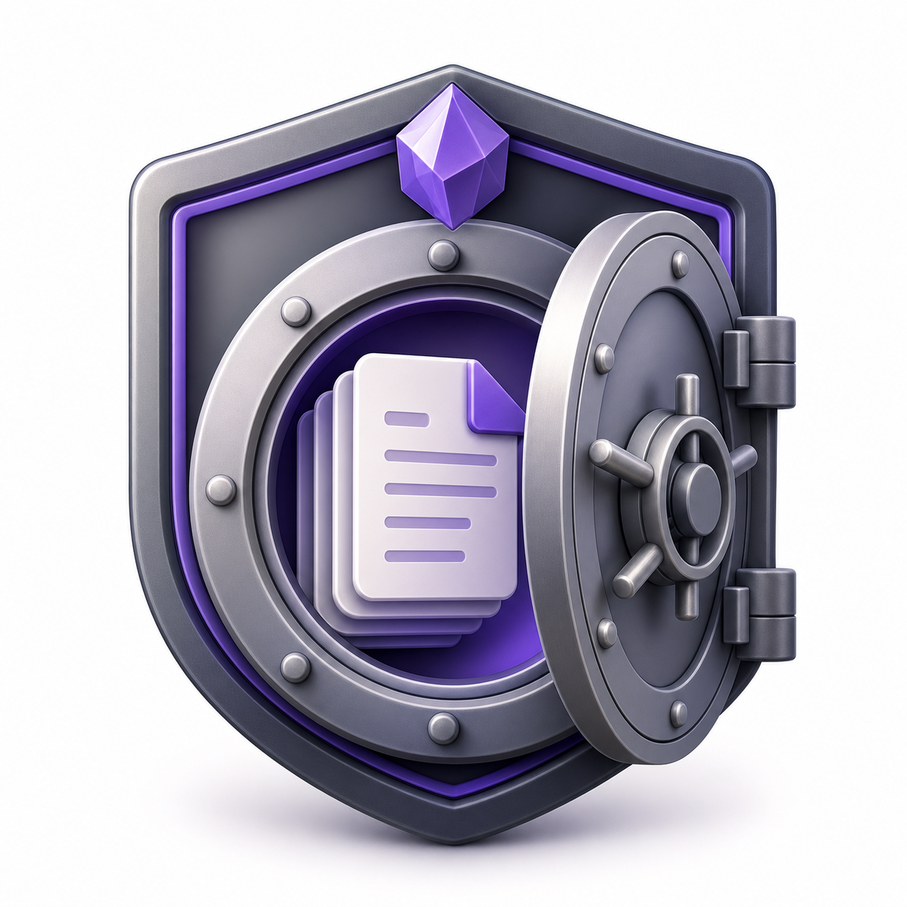
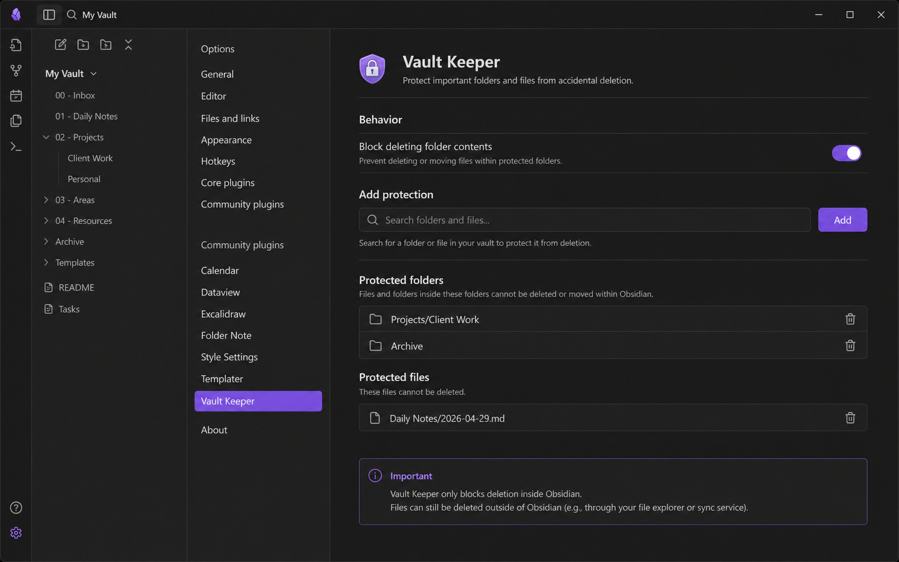

<p align="center">
  
</p>

# Vault Keeper

Protect important Obsidian folders and files from accidental deletion.


Vault Keeper is a focused safety layer for Obsidian vaults. Mark your most important folders and files as protected, and Vault Keeper blocks delete and trash actions for those paths inside Obsidian.

It is built for the small but painful mistakes: deleting an archive folder, removing a client note, or clearing a daily note before you realize it matters.

<p align="center">
  
</p>

> The screenshot above is a README mockup of the plugin settings.

## Features

- Protect individual files from Obsidian delete and trash actions.
- Protect folders from Obsidian delete and trash actions.
- Optionally protect everything inside protected folders.
- Add existing files and folders with Obsidian's native autocomplete UI.
- Keep settings simple, portable, and stored in the plugin data file.
- Show a notice when a protected path is blocked.

## How It Works

Vault Keeper loads your protected folder and file paths from the plugin data file, normalizes them, and keeps a small in-memory protection index.

When the plugin is enabled, it wraps Obsidian's deletion paths:

- `app.vault.delete`
- `app.vault.trash`
- `app.fileManager.trashFile`

Before Obsidian deletes or trashes a file or folder, Vault Keeper checks whether the target path is protected. If it is protected, the plugin shows a notice and stops the operation.

When the plugin unloads, the original Obsidian methods are restored.

## Installation

### BRAT

Vault Keeper is not documented here as an official Community Plugins directory install yet. For beta installation, use BRAT:

1. Install the [BRAT plugin](https://github.com/TfTHacker/obsidian42-brat).
2. Open **Settings -> BRAT -> Beta Plugin List**.
3. Choose **Add Beta plugin**.
4. Paste:

   ```text
   https://github.com/artamrj/obsidian-vault-keeper
   ```

5. Enable **Vault Keeper** in **Settings -> Community plugins**.

### Manual Release Install

1. Download the latest release files from GitHub.
2. Create this folder in your vault:

   ```text
   <your-vault>/.obsidian/plugins/vault-keeper/
   ```

3. Copy these files into that folder:

   ```text
   manifest.json
   main.js
   styles.css
   ```

4. Restart Obsidian or reload plugins.
5. Enable **Vault Keeper** in **Settings -> Community plugins**.

### Local Development Install

Use this when you are developing the plugin from source:

```bash
npm install
npm run build
```

Then copy or symlink this repository into:

```text
<your-vault>/.obsidian/plugins/vault-keeper/
```

## Usage

1. Open **Settings -> Community plugins -> Vault Keeper**.
2. In **Add protection**, search for an existing folder or file.
3. Select a suggestion and click **Add**.
4. Review protected paths under **Protected folders** and **Protected files**.
5. Use the trash button beside a protected path to remove protection.

After a path is protected, deleting or trashing it inside Obsidian will be blocked.

## Settings

### Block Deleting Folder Contents

When enabled, protected folders and everything inside them are blocked from deletion.

When disabled, only the protected folder itself is blocked. Files and folders inside it can still be deleted.

## Limitations

Vault Keeper only blocks deletion through Obsidian's APIs. It cannot prevent deletion from:

- Finder, Explorer, or other file managers
- Terminal commands
- Sync tools
- Mobile file managers
- Other apps with filesystem access

For stronger protection, use Vault Keeper together with backups, sync history, version control, or operating-system permissions.

## Development

```bash
npm install
npm run check
npm run build
npm run dev
```

- `npm run check` runs linting and TypeScript checks.
- `npm run build` validates the plugin and writes the production `main.js`.
- `npm run dev` starts esbuild in watch mode.

### Source Layout

- `src/main.ts` handles the plugin lifecycle and deletion guards.
- `src/core/` contains settings normalization and protection logic.
- `src/settings/` contains the settings tab and autocomplete UI.

## Release

The release workflow builds on pushes to `main`, calculates the next version from conventional commits, updates version files, builds the plugin, tags the release, and uploads:

- `main.js`
- `manifest.json`
- `styles.css`

Before a release, test the plugin in a local vault and run:

```bash
npm run check
npm run build
```

## Troubleshooting

- If a path does not appear in autocomplete, make sure it already exists in the vault.
- If protection does not seem active, reload Obsidian and confirm the plugin is enabled.
- If a path was deleted outside Obsidian, restore it from backups or sync history. Vault Keeper cannot intercept external deletion.
- If a protected folder's child files are still deletable, confirm **Block deleting folder contents** is enabled.

## Contributing

Contributions are welcome. Start with [CONTRIBUTING.md](CONTRIBUTING.md), and review the Obsidian-focused guidance in [docs/OBSIDIAN_PLUGIN_BEST_PRACTICES.md](docs/OBSIDIAN_PLUGIN_BEST_PRACTICES.md).

Good contributions for this plugin include safer path handling, clearer settings UX, mobile compatibility testing, better release documentation, and focused tests around deletion behavior.

## License

MIT. See [LICENSE](LICENSE).
